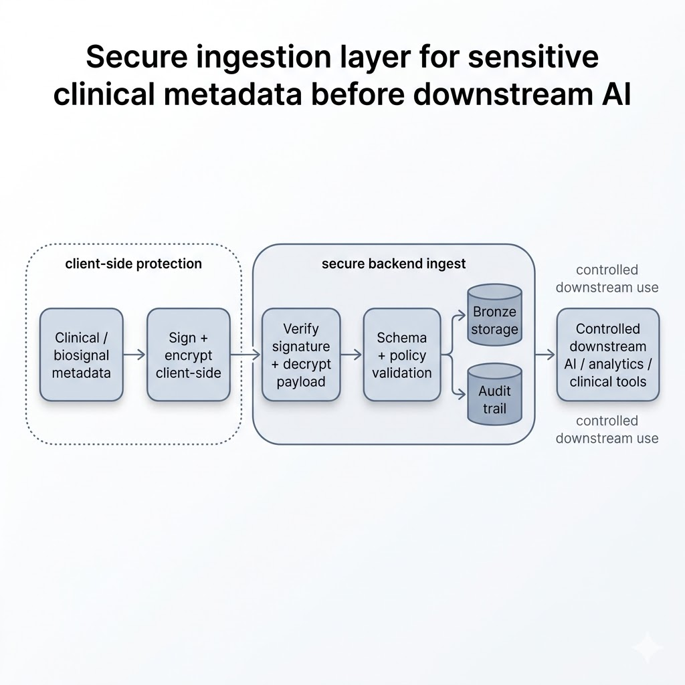
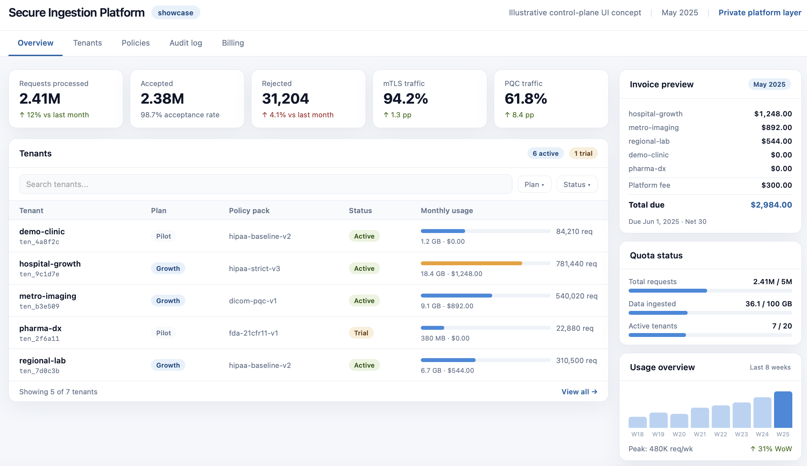
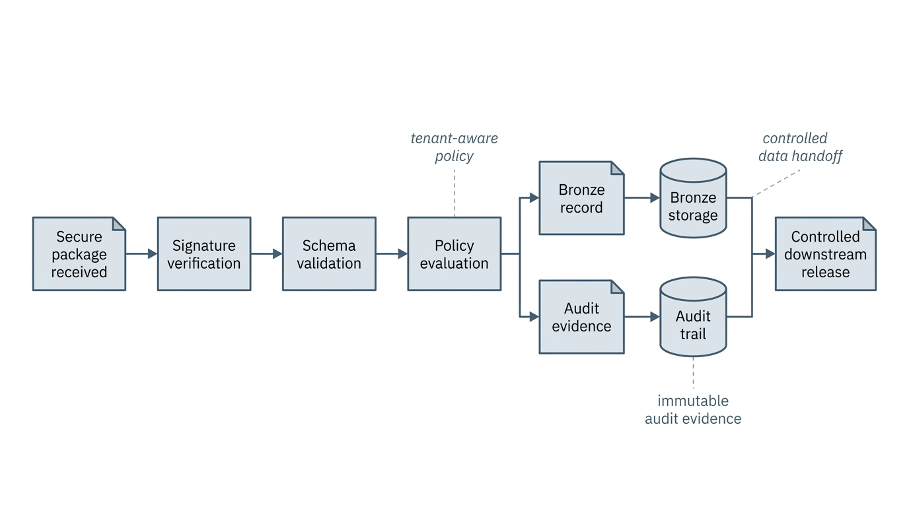
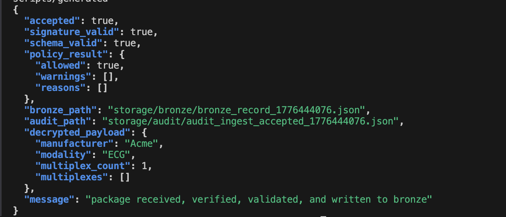
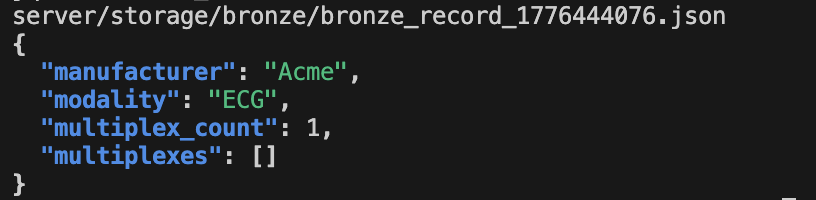
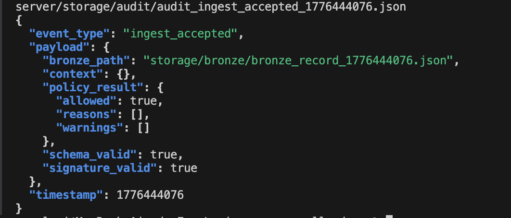

# Secure Ingestion Showcase

Secure ingestion architecture for sensitive metadata before downstream AI, analytics, or clinical tool pipelines.

This repository is a **public showcase**.

It exists to communicate:

- the problem being solved
- the high-level architecture
- the security model
- the demo flow
- representative visuals
- the product direction

It does **not** contain the private product core.

## What the platform does

The platform creates a controlled ingress layer before sensitive metadata enters downstream systems.

Core ideas:

- protect before handoff
- verify before downstream use
- validate schema and policy
- persist Bronze and audit evidence
- control release to downstream AI, analytics, or clinical tools

## Architecture overview

## Security capabilities showcased

This showcase reflects the current secure-ingestion baseline:

- secure package ingest
- schema validation
- policy validation
- Bronze / audit separation
- signed gateway forwarding
- replay protection
- mTLS ingress
- PQC transport hardening track
- live metering into a private platform layer

## Illustrative control-plane UI

The implementation is private. This UI is an illustrative control-plane concept for the private platform layer.

## Bronze / audit model

The ingress path separates normalized operational storage from audit evidence.

## Representative evidence screenshots

### Accepted secure package response

### Bronze output example

### Audit output example

## Public / private split

### Public

This repository contains:

- diagrams
- screenshots
- positioning
- redacted samples
- demo narrative

### Private

The private implementation continues separately and includes:

- control plane
- tenant administration
- billing / metering
- certificate lifecycle
- policy packs
- observability
- deployment automation
- customer integrations

## Current maturity

This is a **secure ingestion baseline**, not a finished production SaaS.

What is already demonstrated:

- signed gateway auth
- replay protection
- PQC transport track
- mTLS-secured ingress
- Bronze / audit write model
- live metering into a private platform foundation

What remains private and productized separately:

- tenant management
- hosted control plane
- billing operations
- dashboarding
- managed certificate lifecycle
- enterprise onboarding
- operational tooling

## Commercial direction

This work is intended to evolve into:

- managed secure-ingestion SaaS
- enterprise deployment package
- architecture + integration engagements
- regulated data handoff hardening

## Private evaluation

Implementation is kept private.

Enterprise / private evaluation is available on request.

## Contents

- `docs/` — diagrams, screenshots, security model, roadmap
- `samples/` — redacted sample payload
- `media/` — optional demo video and visual assets
